# OcarinaCTRComposer

**A cheats + tools overlay for *The Legend of Zelda: Ocarina of Time 3D* — built on
CTRComposer, a raw `.3gx` overlay engine for the 3DS.**

Press **SELECT** in-game to open a themed menu with cheats, a Cheat Search, a RAM Dumper, a
Hex Editor and a full in-game walkthrough — all rendered by the plugin itself.

🌐 **[Project page & install guide](https://samabr85.github.io/OcarinaCTRComposer/)**

https://github.com/user-attachments/assets/914cab43-581b-4a8a-b9d9-e0603246e835

<sub>Also autoplays (muted) on the <a href="https://samabr85.github.io/OcarinaCTRComposer/">project page</a>.</sub>

**Made with [Claude](https://claude.ai).** I'm not a programmer — just a curious player who tests,
pokes at things, and figures out what's missing. Every feature here started as an "I wish this
existed" moment while playing, then got built through back-and-forth with Claude.

---

## Features

- **~60 cheats** in folders (Movement, Battle, Inventory, Time, Quest, Misc.) — data cheats and
  code patches (e.g. Invincible), with **item pickers** that use the real inventory sprites.
- **Teleport** — 30 mapped warp destinations (overworld + every dungeon) with a category filter,
  reliable in towns and dungeons, for **both child and adult** Link.
- **Waypoints** — 9 save/warp slots that **name themselves after the area** ("3. Water Temple R2"),
  persist across sessions, and cross age changes.
- **Toggle Age** — swap child ↔ adult; the label and sword icon show the age you'll become.
- **100% Checklist** — track completion by area; **auto-fill reads your save** and stays in sync
  with the loaded file (it adds what you have and drops what you don't), the rest you mark by hand.
- **Tools:**
  - **Cheat Search** — find any value's address (Known or Unknown value), narrow it down and poke
    it. Undo, memory-region filter, and an on-screen keypad styled after the OoT3D keyboard.
  - **RAM Dumper** — save a block of memory to a `.bin` on the SD card.
  - **Hex Editor** — browse memory as a live hex grid and edit any byte.
- **Game Guide** — a complete OoT3D walkthrough embedded in the plugin (Young/Adult Link, Master
  Quest, item locations, secrets, ocarina songs), readable on the top screen.
- **Plugin Guide** — how to use every feature, in-plugin.
- **Quick Menu** of favorites (cheats, teleport destinations, folder and tool shortcuts), toast
  notifications, and settings that persist across reboots and updates.
- **Rebindable in-game hotkeys** (MoonJump / Fast Move) and a configurable quick-menu combo.
- **SELECT** always returns you to the game; reopening the menu resumes where you left off.
- **26 color themes** (cosmetic) with a live preview — the classic Zelda parchment plus 25 more
  (Game Boy Classic, Synthwave, Zelda BotW, and others).
- **Localization-ready** — the UI ships in **English**, with a built-in system that loads extra
  languages from plain SD text files (`luma/plugins/<TitleID>/lang/`); the embedded Game Guide is
  available in English, Français, Deutsch, Italiano, Español and Português.

---

## Screenshots

| | |
|---|---|
| 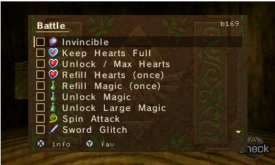 | 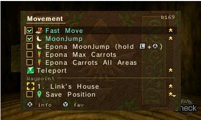 |
| **Battle** — cheats with live checkboxes | **Movement** — Teleport + self-naming waypoints, starred |
| 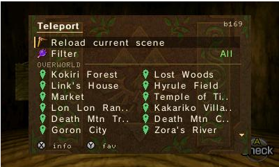 | 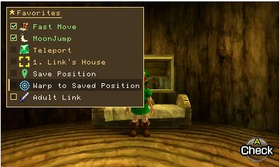 |
| **Teleport** — mapped warps, filterable | **Quick Menu** — favourites (L + SELECT) |
| 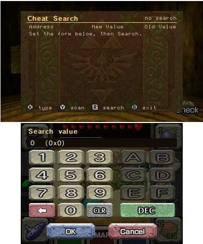 | 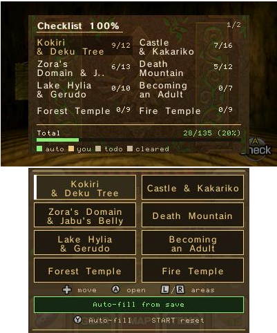 |
| **Cheat Search** — OoT3D-styled keypad | **100% Checklist** — progress by area, auto-fill |
| 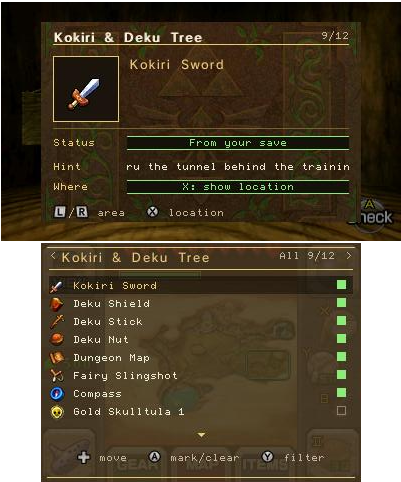 | 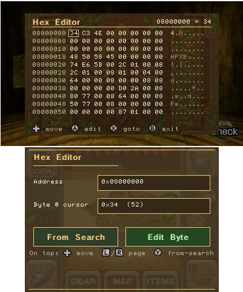 |
| **Checklist item** — hint, location, status | **Hex Editor** — live byte grid |
| 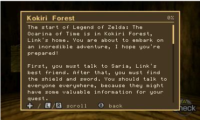 | 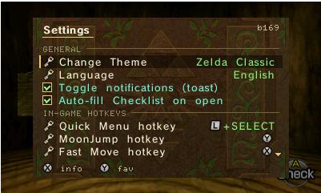 |
| **Game Guide** — embedded walkthrough | **Settings** — themes, language, hotkeys |
| 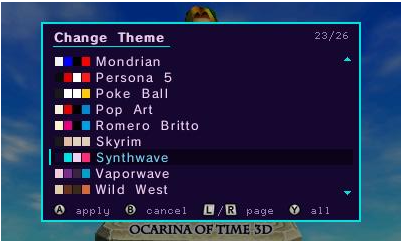 | 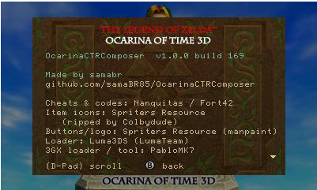 |
| **Change Theme** — 26 themes, live preview | **About** — credits |

<sup>More in [`screenshots/`](screenshots) — every cheat folder, all 26 themes.</sup>

---

## Requirements

- A 3DS (New 3DS recommended) running **Luma3DS** with the **plugin loader** enabled.
- A copy of **Ocarina of Time 3D** (this build targets the **USA** version — see below).

---

## Install

**Manual:**
1. Copy the plugin to your SD card at:
   ```
   sdmc:/luma/plugins/0004000000033500/OcarinaCTRComposer.3gx
   ```
   `0004000000033500` is the **USA** Title ID. (EUR = `0004000000033600`, JPN = `0004000000033400`.)
2. Keep **only one** `.3gx` inside that folder.
3. Open the Rosalina menu (`L + Down + SELECT`) → **Plugin Loader → [Enabled]**.
4. Launch Ocarina of Time 3D and press **SELECT** to open the menu.

**Via [Universal-Updater](https://github.com/Universal-Team/Universal-Updater):**


Settings → Select UniStore → `+` → **Scan QR Code** (scan the image above), then pick
**OcarinaCTRComposer** → Download. Installs straight to your SD card, no PC needed. Same
**samaBR85** store used by [Gen6 CTRPF Overhauled](https://samabr85.github.io/Gen6CTRPFrameworkOverhauled/) —
if you already added it for that plugin, OcarinaCTRComposer is already there too. No scanner
handy? Settings → Select UniStore → `+` → enter the URL instead:
```
raw.githubusercontent.com/samaBR85/Gen6CTRPFrameworkOverhauled/main/unistore/gen6ctrpf.unistore
```

> ### ⚠️ Region / version
> The cheat addresses are fixed to the **USA** version (`0004000000033500`). On EUR/JPN they
> likely differ — enable cheats one at a time; some may not work or may crash if the version
> doesn't match. Start on the USA folder with a USA copy.

---

## Controls

| Button | Action |
|---|---|
| **SELECT** | Open the menu / return to the game (from any screen) |
| **D-Pad ↑ ↓** | Navigate (hold to auto-repeat) |
| **D-Pad ← →** | Jump a page in long lists; change the value on a picker row (Slot, Language, hotkeys) |
| **L / R** | Page through long folders and pickers |
| **A** | Open a folder / toggle a cheat / confirm |
| **B** | Back one level |
| **X** | Info about the selected item |
| **Y** | Star as favorite (cheats, teleport destinations, folders, tools) |
| **START** | Context reset (e.g. wipe all waypoints, or reset the Checklist) |
| **L + SELECT** | Quick Menu (favorites) — combo configurable in Settings |

Touch screen is used where it helps (Cheat Search keypad, Checklist, Hex Editor).

---

## Build from source

Requires **devkitPro** (devkitARM + libctru) and **3gxtool 1.3**
(`thepixellizeross-win/3gxtool`).

> The devkitPro toolchain breaks on paths containing spaces. Build from a space-free path,
> using the devkitPro msys2 shell:

```sh
/c/devkitPro/msys2/usr/bin/bash.exe -lc 'cd <project-no-spaces> && make'
```

The output `OcarinaCTRComposer.3gx` goes into the Title ID folder as shown in **Install**.

### Make your own plugin

The engine behind this plugin — **CTRComposer** — is **game-agnostic** and released separately as a
blank, buildable template (menu, themes, tools, guide reader, system font, framebuffer rendering,
game pause, persistence, quick menu, keypad, button glyphs). A new plugin is essentially a **cheat
table + art + Title ID**. See the **[CTRComposer](https://github.com/samaBR85/CTRComposer)** repo to
bootstrap a plugin for another 3DS game.

---

## Credits

- **Original OoT3D cheats plugin & cheat codes** — Nanquitas · https://github.com/Nanquitas
- **Luma3DS** (plugin loader) — https://github.com/LumaTeam/Luma3DS
- **3GX plugin loader / 3gxtool** — PabloMK7 · https://github.com/PabloMK7
- **Walkthrough text** — z64central.com (Zelda Ocarina 3D Help)
- **Walkthrough packaged for the plugin** — LowEndC (GBAtemp)
- **Item sprites** — The Spriters Resource, ripped by Colbydude · https://www.spriters-resource.com/3ds/thelegendofzeldaocarinaoftime3d/
- **Progressive save files** (used to map the game's save data for the 100% Checklist auto-fill) — HelpTheWretched (HTW) · https://gbatemp.net/download/start-to-finish-zelda-saves-for-ds-3ds-wii.37279/
- **OoT3D Practice Menu** (reference for the entrance-warp mechanism, RAM symbol addresses, and entrance-index tables behind the Teleport feature) — gamestabled · https://github.com/gamestabled/oot3d_practice_menu
- **OoT3D Practice Menu (advanced fork)** (updated warp code, expanded entrance list, and New 3DS ZL/ZR input reference) — HylianFreddy · https://github.com/HylianFreddy/oot3d_practice_menu
- Additional codes — Fort42

*Rendering techniques referenced from CTRPluginFramework.*

---

## License

The plugin's own source code is **[MIT](LICENSE)**. Third-party material (see **Credits**) stays
under its owners' rights, and game IP is © Nintendo — see the disclaimer below.

---

## Disclaimer

Fan project, **non-commercial**. *The Legend of Zelda: Ocarina of Time* and all game content
are © Nintendo. This plugin contains no game assets; it reads and modifies the running game's
memory on the user's own console. Use at your own risk.
